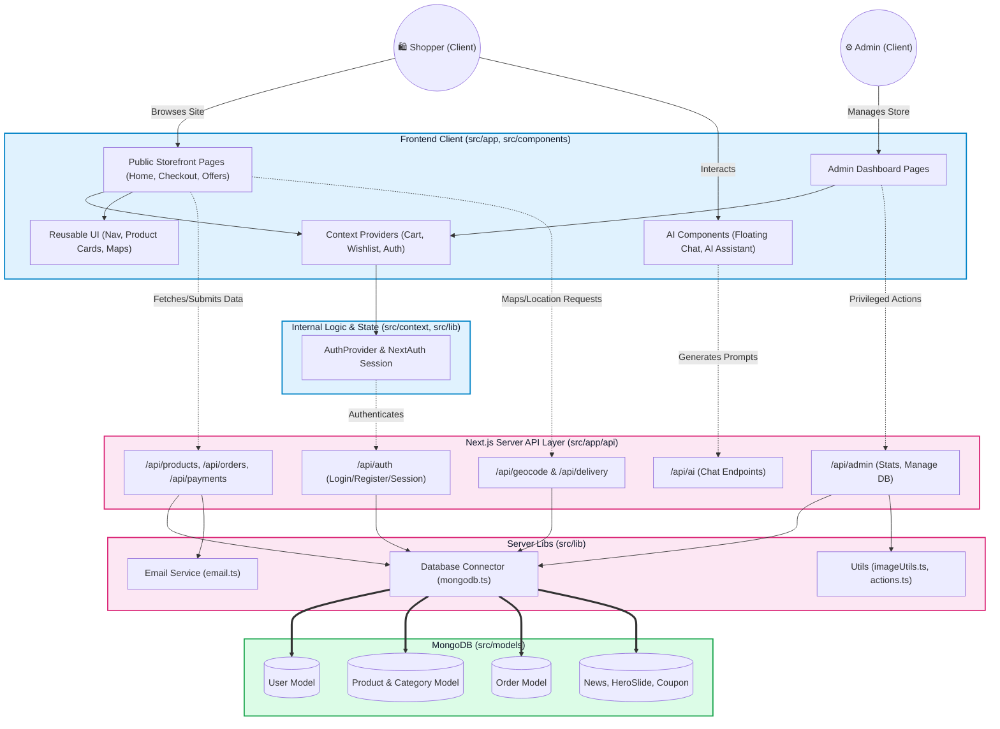

# Next-Grocery Project Flowchart

This flowchart visualizes the high-level architecture of your Next.js e-commerce application. It demonstrates the flow of data across the different layers of your application architecture: from the frontend components and state providers to the server logic (Next.js API Routes and specialized library utilities) down to your database models.

### Flowchart Breakdown

1. **Frontend Client**: Shows the separation between the standard shopping interface (`Public Storefront Pages`) and the `Admin Dashboard`. It utilizes contexts for state management, mapping components, and interactive AI widgets. Data visually flows into context providers.
2. **Server API Layer**: Divides into your public/user APIs, admin-only routes, authentication endpoints, and specific utility endpoints like Geo/Map lookup and AI Chat generation.
3. **Server Libraries**: Illustrates the underlying library files (`src/lib`) acting as a bridge. For instance, the DB connection utility, image handlers, and the email dispatcher service.
4. **Data Tier (MongoDB)**: Represents your schema and modeling abstractions from `src/models`, maintaining strict structures for records like Orders, Users, Products, and other application settings.
